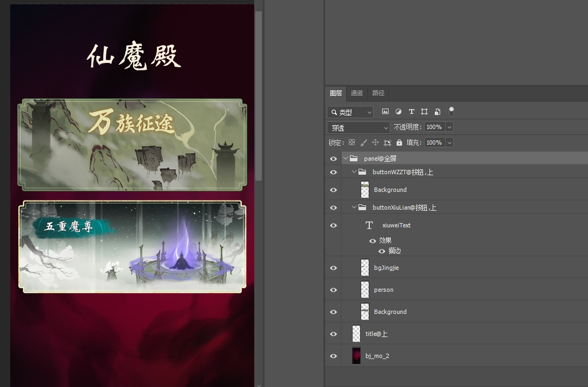
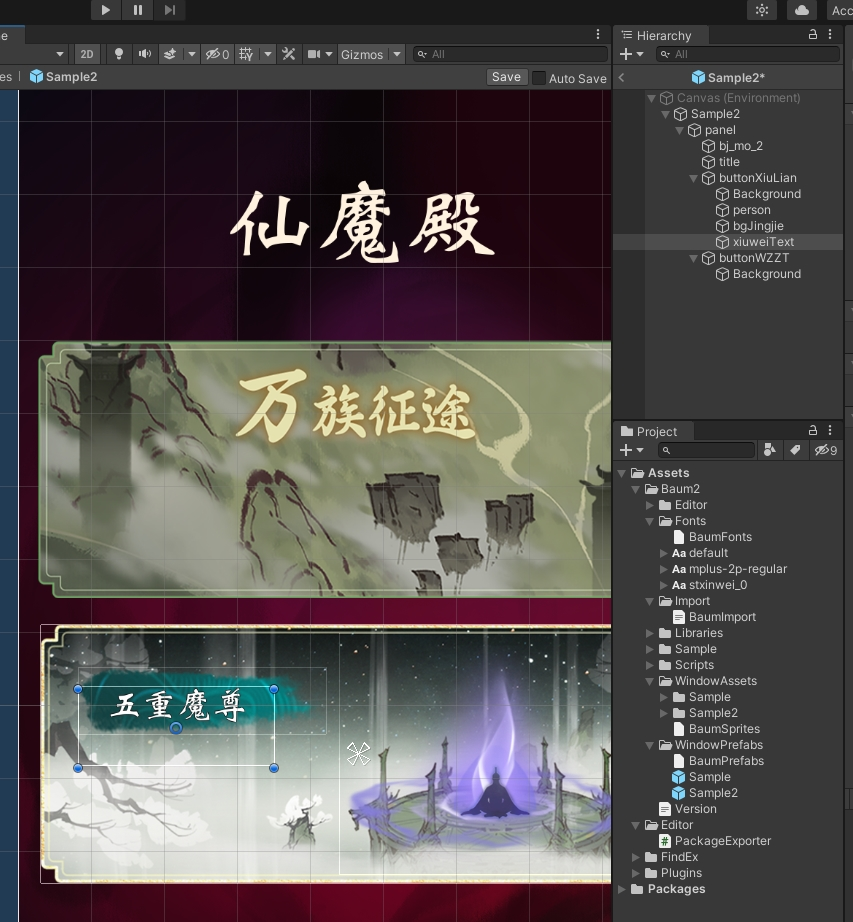

PSD转Unity工具
=====

* 基于baum2改进
* 原始项目地址： https://github.com/kyubuns/Baum2

使用说明
====
* 把PhotoshopScript下的JSZXPsd2Unity目录拷贝到 `<PS安装目录>\Presets\Scripts`
* 使用Unity打开示例项目
* 打开示例psd文件，在根目录的Psd目录下，点击 `文件 -> 脚本 -> PSD导出Unity`
* 选择示例项目的目录：`Assets/Editor/Psd2Ugui/Studio/Import` 进行导出
* 切换到Unity，打开示例项目中 `Assets/Editor/Psd2Ugui/Studio/WindowPrefabs` 中psd同名的prefab，双击即可查看
* 生成的prefab在 `Assets/Editor/Psd2Ugui/Studio/WindowPrefabs` 中
* 生成的切图结果在 `Assets/Editor/Psd2Ugui/Studio/WindowAssets` 中
* 生成的大图结果在 `Assets/Editor/Psd2Ugui/Studio/Texture` 中

PS示例
====


Unity示例
====



扩展功能
=====

* @后的参数扩展
  * pivot支持使用中文指定
    * 上、下、左、右、左上、左下、右上、右下
    * 全屏：对应对于父节点全屏拉伸
  * 各种控件指定支持中文指定
     * Button: 按钮
     * List: 列表
     * Slider: 进度条
     * Scrollbar: 滚动条
     * Toggle: 开关
  * 添加新的控件
     * 预制体:
        * 写法：@预制体=项目中预制体名
        * 制作流程
           1. 将对应的png文件拖入Psd文件中
           2. 建立一个组，并命名为`真实名字@预制体=项目中预制体名`
           3. 将png所在的图层放入组内，并将图层名添加`$`前缀
* 新的前缀
  * 注释：
  * 使用`#`作为前缀，图层用于显示而不导出
  * 使用`$`作为前缀，图层用于显示而不导出，但是会占用父层级的大小
* 导出调整
  * 去除1344大小的限制，改为2048
* 导入调整
  * 根GameObject的Stretch改为全屏扩展
  * 找不到字体的时候使用默认字体
  * 字体默认都变成垂直向上对齐（ps中没有垂直居中）

外部API
=====

可在自己的项目中使用以下API进行扩展

```c#
[InitializeOnLoad]
public class Psd2UguiManager
{
    static List<Type> TypeOfAddRCMap = new List<Type>
    {
        typeof(EnhancedScroller),
        typeof(ExtHorizontalLayoutGroup),
        typeof(ExtVerticalLayoutGroup),
        typeof(ReferenceCollector),
        typeof(Button),
        typeof(Text),
    };

    static Psd2UguiManager()
    {
        // 添加图片导入后回调
        PreprocessTexture.OnPreprocessTextureFunc = (assetPath, assetImporter) =>
        {
            PreprocessTexture.DefaultTexturePreprocess(assetPath, assetImporter);
        };
        // 添加类型映射
        BaumElementHelper.AddComponentTypeByElement<Image, ExtImage>();
        // 添加新的组件
        ElementFactory.AddElement("List", (d, p) => new ListElement(d, p));
        ElementFactory.AddElement("LoopList", (d, p) => new LoopListElement(d, p));
        // 添加预制体生成后的回调
        PrefabCreator.OnCreateFunc = (creator, go) =>
        {
            // 添加RC
            var rc = go.AddMissingComponent<ReferenceCollector>();
            foreach (var t in TypeOfAddRCMap)
            {
                var coms = go.GetComponentsInChildren(t);
                for (int i = 0; coms != null && i < coms.Length; i++)
                {
                    var com = coms[i];
                    // 不添加子部件的子节点
                    if (PrefabUtility.IsPartOfNonAssetPrefabInstance(com.gameObject))
                        continue;
                    var addCom = com.GetComponent(t);
                    if (addCom == rc)
                        continue;
                    rc.data.Add(new ReferenceCollectorData() { key = com.name, gameObject = addCom });
                }
            }
        };
    }
}
```

